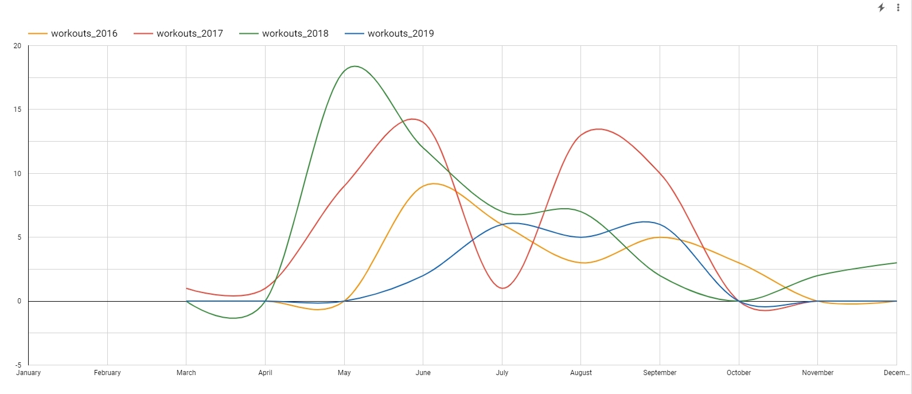
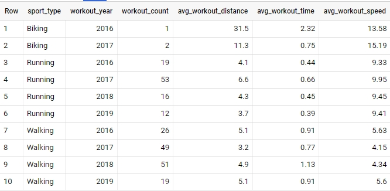

## Endomondo data analysis

Once the raw XML data was extracted and parsed into csv files, they were loaded into Google BigQuery. Now it is time to do some data analysis and try to answer some questions such as:
- What are the places with the most workouts?
- What kind of workout types were captured per each year?
- What are the monthly dynamics for each year and for each workout type?
- Which day of the week was the most popular for workouts?
- Which hour of the day was the most popular for workouts?
- What is the average workout distance, time and speed for each workout type?
- Which part of the workout has higher speed - start or end of the workout?

### What are the places with the most workouts?

As seen from the map below, the majority of workouts are in the Vilnius area. Red color marks the walking workouts, green color - running workouts, and the blue color - biking workouts.


```sql
SELECT
    CASE WHEN s.sport_type = 'Other' THEN 'Walking' ELSE s.sport_type END AS sport_type,
    ST_GEOGPOINT(t.tracking_longitude, t.tracking_latitude) AS workout_coordinates
FROM Endomondo.summary AS s
INNER JOIN Endomondo.tracking AS t
ON s.activity_id = t.activity_id
```

### What kind of workout types were captured per each year?

As seen from the table below, 2017 was the year with the most workouts captured, mostly walking and running (null marks total workouts). The most walking workouts were captured in 2018. The least total workouts were captured in 2019. We can also see that walking workouts were the most popular amongst other workout types, while biking workouts were very rare.


```sql
SELECT
    CASE WHEN sport_type = 'Other' THEN 'Walking' ELSE sport_type END AS sport_type,
    SUM(CASE WHEN EXTRACT(year FROM start_date) = 2016 THEN 1 ELSE 0 END) AS year_2016,
    SUM(CASE WHEN EXTRACT(year FROM start_date) = 2017 THEN 1 ELSE 0 END) AS year_2017,
    SUM(CASE WHEN EXTRACT(year FROM start_date) = 2018 THEN 1 ELSE 0 END) AS year_2018,
    SUM(CASE WHEN EXTRACT(year FROM start_date) = 2019 THEN 1 ELSE 0 END) AS year_2019
FROM Endomondo.summary
GROUP BY ROLLUP(sport_type)
```

### What are the monthly dynamics for each year and for each workout type?

In the following graph we can see that running workouts were captured specifically from May to September, all the 4 years and the most running workouts were captured in 2017.


Walking workouts were captured during other months, from March to December. We can see that the peak months were during May-June and the decrease on later months, with the exception in 2017.



```sql
SELECT
    CASE WHEN sport_type = 'Other' THEN 'Walking' ELSE sport_type END AS sport_type,
    EXTRACT(month FROM start_date) AS workout_month,
    SUM(CASE WHEN EXTRACT(year FROM start_date) = 2016 THEN 1 ELSE 0 END) AS workouts_2016,
    SUM(CASE WHEN EXTRACT(year FROM start_date) = 2017 THEN 1 ELSE 0 END) AS workouts_2017,
    SUM(CASE WHEN EXTRACT(year FROM start_date) = 2018 THEN 1 ELSE 0 END) AS workouts_2018,
    SUM(CASE WHEN EXTRACT(year FROM start_date) = 2019 THEN 1 ELSE 0 END) AS workouts_2019
FROM Endomondo.summary
GROUP BY 1, 2
```

### Which day of the week was the most popular for workouts?

We can see that Friday and Sunday were the two most popular days for doing workouts, Sunday being the most popular for running and Friday being the most popular for walking. The day with the least workouts was Saturday.


```sql
SELECT
    CASE WHEN sport_type = 'Other' THEN 'Walking' ELSE sport_type END AS sport_type,
    SUM(CASE WHEN FORMAT_DATE('%A', start_date) = 'Monday' THEN 1 ELSE 0 END) AS monday,
    SUM(CASE WHEN FORMAT_DATE('%A', start_date) = 'Tuesday' THEN 1 ELSE 0 END) AS tuesday,
    SUM(CASE WHEN FORMAT_DATE('%A', start_date) = 'Wednesday' THEN 1 ELSE 0 END) AS wednesday,
    SUM(CASE WHEN FORMAT_DATE('%A', start_date) = 'Thursday' THEN 1 ELSE 0 END) AS thursday,
    SUM(CASE WHEN FORMAT_DATE('%A', start_date) = 'Friday' THEN 1 ELSE 0 END) AS friday,
    SUM(CASE WHEN FORMAT_DATE('%A', start_date) = 'Saturday' THEN 1 ELSE 0 END) AS saturday,
    SUM(CASE WHEN FORMAT_DATE('%A', start_date) = 'Sunday' THEN 1 ELSE 0 END) AS sunday
FROM Endomondo.summary
GROUP BY ROLLUP(sport_type)
```

### Which hour of the day was the most popular for workouts?

It is interesting to understand which hours of the day were the most popular for doing workouts. In the graph below we can see more evening workouts compared with the morning workouts (total count in bar charts). If we split workouts by type, we can see that running workouts were the most popular in the evenings, specifically around 7pm-8pm. Walking workouts were more popular in the middle and the end of the day.

As workout hours are captured in GMT, 2 hours were added to calculate the local time. Also, some coordinates were filtered out, specifically the coordinates with Longitude values less than 0.


```sql
SELECT
    EXTRACT(hour FROM s.start_time) + 2 AS workout_hour,
    COUNT(DISTINCT CASE WHEN s.sport_type = 'Running' THEN s.activity_id ELSE NULL END) AS running_count,
    COUNT(DISTINCT CASE WHEN s.sport_type = 'Other' THEN s.activity_id ELSE NULL END) AS walking_count,
    COUNT(DISTINCT CASE WHEN s.sport_type = 'Biking' THEN s.activity_id ELSE NULL END) AS biking_count,
    COUNT(DISTINCT s.activity_id) AS total_count
FROM Endomondo.summary AS s
INNER JOIN Endomondo.tracking AS t
ON s.activity_id = t.activity_id
WHERE t.tracking_longitude > 0
GROUP BY 1
```

### What is the average workout distance, time and speed for each workout type?

The following table shows various statistics for each workout type through the years. We can see that biking workouts had the largest distance and speed. Running workouts were approximately around 4km of length during 2016, 2018 and 2019, with the exception in 2017, where the average distance was 6.6km. The running speed was pretty consistent during all the years and it was approximately 9.5 km/h. Walking workouts were approximately around 5km of length during 2016, 2018 and 2019, with the exception in 2017, where the average distance was 3.2km. Walking workout in 2017 were also the slowest and with the lowest duration.



```sql
SELECT
    CASE WHEN sport_type = 'Other' THEN 'Walking' ELSE sport_type END AS sport_type,
    EXTRACT(year FROM start_date) AS workout_year,
    COUNT(activity_id) AS workout_count,
    ROUND(AVG(total_distance/1000),1) AS avg_workout_distance,
    ROUND(AVG(total_time/3600),2) AS avg_workout_time,
    ROUND(AVG(total_distance/1000) / AVG(total_time/3600),2) AS avg_workout_speed
FROM Endomondo.summary
GROUP BY 1, 2
ORDER BY sport_type, workout_year
```

### Which part of the workout has higher speed - start or end of the workout?

I wanted to understand if the higher speed of workout captured at the start of the workout or at the end of workout. I have split each workout even further - into 4 quartiles, instead of the halves.

As seen from the graph below, biking speed is decreasing quite significantly at the end of workout, from 15.3 km/h to 10.9 km/h, probably due to fatigue. Running workout speed is also decreasing, from 10 km/h to 9.4 km/h, but not so significantly as for biking workouts. Walking workouts speed, differently from biking and running, is quite stable at around 5.1-5.2 km/h.


```sql
WITH calculations AS (
    SELECT
        activity_id,
        tracking_id,
        COUNT(tracking_id) OVER (PARTITION BY activity_id) AS trackings_per_activity,
        tracking_distance - LAG(tracking_distance)
          OVER (PARTITION BY activity_id ORDER BY tracking_id) AS distance_per_activty,
        EXTRACT(second FROM tracking_time - LAG(tracking_time)
          OVER (PARTITION BY activity_id ORDER BY tracking_id)) AS time_per_activity
    FROM Endomondo.tracking
)
SELECT
    CASE WHEN sport_type = 'Other' THEN 'Walking' ELSE sport_type END AS sport_type,
    CASE WHEN tracking_id / trackings_per_activity <= 0.25 THEN 'workout_1q'
         WHEN tracking_id / trackings_per_activity <= 0.5 THEN 'workout_2q'
         WHEN tracking_id / trackings_per_activity <= 0.75 THEN 'workout_3q'
         ELSE 'workout_4q'
    END AS workout_split,
    SUM(distance_per_activty/1000) / SUM(time_per_activity/3600) AS workout_speed
FROM calculations AS c
INNER JOIN Endomondo.summary AS s
ON c.activity_id = s.activity_id
GROUP BY 1, 2
```
